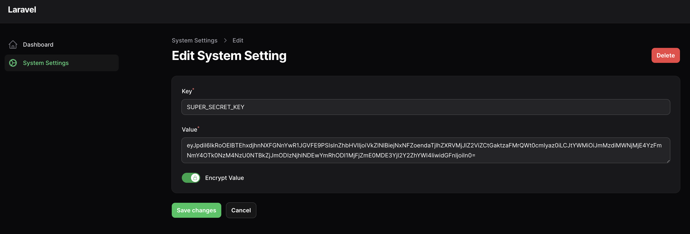

## Filament System Settings

This package aims to provide a minimal implementation for creating a database driven encryptable key value storage for projects using Filament.




## Installation
Installation can be done via composer. Run the following command in your laravel root directory.

```
composer require aashan/filament-system-settings
```

### Registering Resource in a Panel
In `app/Providers/Filament/AdminPanelProvider.php` (or any other filament panel provider), add the following lines.

```php

use Aashan\FilamentSystemSettings\SystemSetting;

class AdminPanelProvider extends PanelProvider 
{
    public function panel(Panel $panel): Panel
    {
        ... 
        return SystemSettings::register($panel);
    }
}
```
